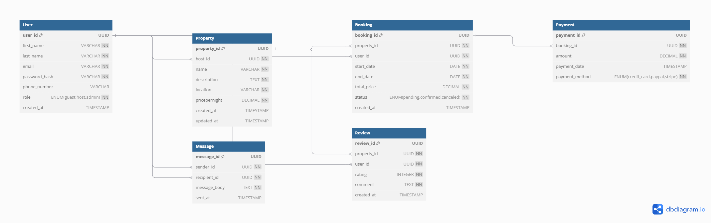

# Database Requirements

This document outlines the database structure for the Property Booking Platform (Airbnb-style app).

---

## 🖼 Entity Relationship Diagram (ERD)

## 🧩 Entities and Attributes

### 1. User
Represents users of the platform.

| Field         | Type            | Constraints                        |
|--------------|------------------|-------------------------------------|
| user_id      | UUID             | Primary Key, Indexed                |
| first_name   | VARCHAR          | Not Null                            |
| last_name    | VARCHAR          | Not Null                            |
| email        | VARCHAR          | Unique, Not Null                    |
| password_hash| VARCHAR          | Not Null                            |
| phone_number | VARCHAR          | Optional                            |
| role         | ENUM             | guest, host, admin (Not Null)       |
| created_at   | TIMESTAMP        | Default: CURRENT_TIMESTAMP          |

---

### 2. Property
Listings posted by hosts.

| Field         | Type     | Constraints                        |
|---------------|----------|------------------------------------|
| property_id   | UUID     | Primary Key, Indexed               |
| host_id       | UUID     | Foreign Key → User(user_id)        |
| name          | VARCHAR  | Not Null                           |
| description   | TEXT     | Not Null                           |
| location      | VARCHAR  | Not Null                           |
| pricepernight | DECIMAL  | Not Null                           |
| created_at    | TIMESTAMP| Default: CURRENT_TIMESTAMP         |
| updated_at    | TIMESTAMP| On Update                          |

---

### 3. Booking
Links guests to properties.

| Field         | Type     | Constraints                        |
|---------------|----------|------------------------------------|
| booking_id    | UUID     | Primary Key, Indexed               |
| property_id   | UUID     | Foreign Key → Property(property_id)|
| user_id       | UUID     | Foreign Key → User(user_id)        |
| start_date    | DATE     | Not Null                           |
| end_date      | DATE     | Not Null                           |
| total_price   | DECIMAL  | Not Null                           |
| status        | ENUM     | pending, confirmed, canceled       |
| created_at    | TIMESTAMP| Default: CURRENT_TIMESTAMP         |

---

### 4. Payment
Payments made for bookings.

| Field         | Type     | Constraints                        |
|---------------|----------|------------------------------------|
| payment_id    | UUID     | Primary Key, Indexed               |
| booking_id    | UUID     | Foreign Key → Booking(booking_id)  |
| amount        | DECIMAL  | Not Null                           |
| payment_date  | TIMESTAMP| Default: CURRENT_TIMESTAMP         |
| payment_method| ENUM     | credit_card, paypal, stripe        |

---

### 5. Review
Ratings and comments on properties.

| Field         | Type     | Constraints                        |
|---------------|----------|------------------------------------|
| review_id     | UUID     | Primary Key, Indexed               |
| property_id   | UUID     | Foreign Key → Property(property_id)|
| user_id       | UUID     | Foreign Key → User(user_id)        |
| rating        | INTEGER  | 1 to 5                             |
| comment       | TEXT     | Not Null                           |
| created_at    | TIMESTAMP| Default: CURRENT_TIMESTAMP         |

---

### 6. Message
Direct messages between users.

| Field         | Type     | Constraints                        |
|---------------|----------|------------------------------------|
| message_id    | UUID     | Primary Key, Indexed               |
| sender_id     | UUID     | Foreign Key → User(user_id)        |
| recipient_id  | UUID     | Foreign Key → User(user_id)        |
| message_body  | TEXT     | Not Null                           |
| sent_at       | TIMESTAMP| Default: CURRENT_TIMESTAMP         |

---

## 🔗 Relationships Summary

- A **User** can be a guest, host, or admin.
- A **Host (User)** can own many **Properties**.
- A **Guest (User)** can create many **Bookings**.
- Each **Booking** is tied to one **Property** and one **User**.
- A **Payment** is linked to one **Booking**.
- A **Review** is posted by a **User** for a **Property**.
- **Messages** are sent between **Users**.

---

## 📌 Notes
- All UUID fields are indexed.
- `email` is uniquely indexed.
- Enum fields enforce allowed values (e.g., roles, status, payment methods).
